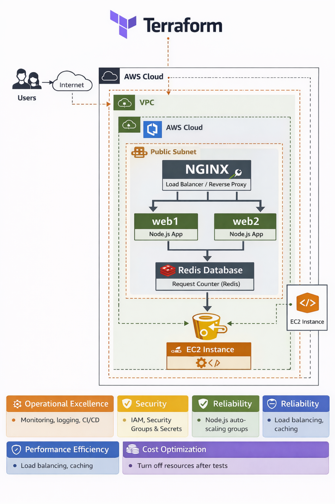

# 🚀 CI/CD for Terraform with GitHub Actions Deploying a Node.js + Redis App on AWS ###

## 🏗️ Architecture Overview (AWS Well-Architected) Pillars covered

The diagram below illustrates how this project is deployed on AWS using **Terraform**, **Docker**, and **GitHub Actions**, aligned with the **AWS Well-Architected Framework**.

- No ALB or Route 53 is used
- Traffic is handled by **NGINX inside a single EC2 instance**
- Multiple Node.js containers provide redundancy
- Redis maintains shared application state



| Pillar                     | How It’s Addressed                          |
| -------------------------- | ------------------------------------------- |
| **Operational Excellence** | CI/CD, automation, reproducibility          |
| **Security**               | IAM, Security Groups, least privilege       |
| **Reliability**            | Multiple app containers, Redis-backed state |
| **Performance Efficiency** | NGINX load distribution                     |
| **Cost Optimization**      | Automated teardown via CI/CD                |


### Architecture Highlights

- **Terraform** provisions AWS infrastructure (EC2, Security Groups)
- **Docker Compose** runs NGINX, Node.js, and Redis on EC2
- **NGINX** acts as a reverse proxy and load distributor
- **Redis** enables shared state across Node.js containers
- **GitHub Actions** automates infrastructure lifecycle and deployments

### 📌 Project Overview

This is a **beginner-friendly DevOps project** designed to demonstrate how to deploy a simple **Node.js + Redis Request Counter application** on AWS using **Terraform** and **GitHub Actions CI/CD**.

While the application itself is intentionally simple, the real value of this project lies in learning how **modern DevOps tools work together** to create a **repeatable, automated, and production-ready workflow**.

### 🎯 What This Project Demonstrates
- 🏗 Infrastructure as Code (IaC) using **Terraform**
- 🐳 Containerization with Docker & **Docker & Docker Compose**
- 🌐 Reverse proxy & traffic distribution using **NGINX**
- 🔄 CI/CD automation using **GitHub Actions**
- 🔐 Secure **AWS deployments** using IAM & Security Groups
- 💰 Cost-aware workflows with automated teardown
- 🚀 Real-world CI/CD change propagation via **git push 🚀**
---

### 🧠 Application Concept
The application is a **Request Counter** that:
- Tracks total page visits using **Redis**
- Displays:
  - Total visit count
  - Hostname serving the request (`web1` or `web2`)
- Runs on **Node.js (Express)**
- Served via **NGINX**
- Enhanced with a **beautiful HTML UI 🎨**
---
### 🛠 Pre-requisites
### 1️⃣ AWS Account & IAM User

Create an IAM user

Generate:
- `AWS_ACCESS_KEY_ID`
- `AWS_SECRET_ACCESS_KEY`

### 2️⃣ Install Docker (macOS)
### Installing Docker and Docker Compose on macOS

Docker allows you to create, deploy, and run applications in containers.

```bash
brew install docker

brew install docker-compose
```
### 3️⃣ Fork & Clone Repository
```bash
git clone https://github.com/<your-username>/nginx-node-redis.git

cd nginx-node-redis
```
### 🧪 Testing Locally with Docker Compose
```bash
docker compose up --build
```

This will:
- Build all images
- Start **Redis**, **Node.js** apps, and **NGINX**
- Expose the app on `port 80`

👉 Visit: 
```bash 
http://localhost 
```
Refresh the page to see:
- Counter increment
- Hostname switching between `web1` and `web2`

### ⚙️ Terraform Deployment (AWS)
```bash
cd terra-config
terraform init
terraform plan -out=tfplan
terraform apply -auto-approve tfplan
```
### 📌 Important

Update the repo URL in `user_data`:
```bash
git clone https://github.com/<your-username>/nginx-node-redis.git
```
### 🔐 GitHub Actions → AWS Access

Add the following GitHub Secrets:

| Secret Name               | Value                   |
|---------------------------|-------------------------|
| ``AWS_ACCESS_KEY_ID``       | Your AWS Access Key     |
| ``AWS_SECRET_ACCESS_KEY``    | Your AWS Secret Key     |


### Path:

```bash
GitHub Repo → Settings → Secrets → Actions
```

### 🔄 CI/CD Workflow

Once configured:
    1. Push code to GitHub
    2. GitHub Actions:
        - Provisions AWS infrastructure
        - Deploys the application
        - Runs health checks
        - Optionally destroys resources 💰
    3. Changes go live automatically 🚀

### 🌍 Real-World Change Demo

- Modify `server.js`
- Commit & push changes
- **GitHub** Actions redeploys automatically
- Refresh EC2 public IP → changes are live

## 🧩 Key Components Explained

### 🔹 `web/server.js`
- Connects to **Redis** on port `6379`
- Increments and displays the **total visit count**
- Displays the **hostname** serving the request (`web1` / `web2`)
- Runs on **port `5000`**
- Enhanced with a **visually appealing HTML UI** 🎨

### 🔹 `nginx/nginx.conf`
- Acts as a **reverse proxy**
- Distributes incoming traffic evenly across:
  - `web1:5000`
  - `web2:5000`

### 🔹 `docker-compose.yml`
Orchestrates the complete multi-container setup:
- **Redis container** (database)
- **Two Node.js containers** (`web1`, `web2`)
- **NGINX container** (reverse proxy and traffic distributor)

### 🔹 `terra-config`
Infrastructure as Code implemented using **Terraform**:
- Uses the **default VPC**
- Creates a **Security Group** allowing:
  - Port `22` (SSH)
  - Port `80` (HTTP)
- Launches an **EC2 instance**
- Installs **Docker & Docker Compose**
- Automatically deploys the application via `user_data`

### 🔮 Future Enhancements
This project is intentionally kept simple to highlight core DevOps principles. However, it can be extended in several real-world directions to make it more production-grade and scalable:

**☁️ Infrastructure & Scalability**
- Migrate from a single EC2 instance to Auto Scaling Groups
- Introduce an Application Load Balancer (ALB) in front of NGINX
- Add Route 53 for DNS-based routing
- Move Redis to Amazon ElastiCache for managed availability

**🐳 Container Orchestration**
- Migrate from Docker Compose to Amazon EKS
- Use Kubernetes Deployments & Services instead of static containers
- Implement Horizontal Pod Autoscaling (HPA)

**🔐 Security Enhancements**
- Use IAM Roles for EC2 instead of static credentials
- Store secrets securely using AWS Secrets Manager
- Enable VPC endpoints for private service access
- Add HTTPS (TLS) with ACM certificates

**🔄 CI/CD Improvements**
- Add Terraform validation & linting (tflint, terraform fmt)
- Introduce environment-based deployments (dev / staging / prod)
- Implement blue-green or canary deployments
- Add approval gates for production changes

**📊 Observability & Monitoring**
- Integrate CloudWatch logs & metrics
- Add application-level monitoring (Prometheus / Grafana)
- Implement health checks & alerting
- Track request latency and error rates

**💰 Cost Optimization**
- Use Spot Instances for non-production workloads
- Automatically destroy environments after test completion
- Add cost visibility using AWS Cost Explorer

**🧪 Testing & Quality**
- Add unit and integration tests for the Node.js app
- Implement container image scanning
- Add security scanning in CI/CD pipeline


## Why This Matters
These enhancements demonstrate how a simple demo can evolve into a production-grade cloud platform, mirroring how real-world systems grow over time.

*This roadmap shows not just what works today, but how to scale responsibly tomorrow*

---

## 🌟 Why This Project Stands Out
- This project goes beyond a basic demo by showcasing real-world DevOps and cloud engineering practices:
- Demonstrates end-to-end automation — from local development to cloud deployment
- Uses Infrastructure as Code (Terraform) instead of manual AWS setup
- Integrates CI/CD with GitHub Actions, mirroring modern engineering workflows
- Balances simplicity and scalability without over-engineering
- Emphasizes cost awareness, security, and operational discipline
- Designed with the AWS Well-Architected Framework in mind

This repository reflects how production systems are built incrementally, with automation, reliability, and clarity at the core.

## 📘 Lessons Learned

Building this project provided hands-on exposure to real-world DevOps and cloud engineering practices. Key takeaways include:

**🏗 Infrastructure as Code (Terraform)**
- Defining infrastructure declaratively ensures repeatability and consistency
- Terraform plans act as a safety net before making cloud changes
- Small misconfigurations (VPCs, subnets, security groups) can have big impact
- `user_data` is a powerful way to bootstrap infrastructure automatically

**🐳 Containers & Docker** 
- Containerization makes applications portable and environment-independent
- Docker Compose is ideal for local development and testing
- Clear service naming simplifies networking between containers
- Layered Docker images help optimize build performance

**🔄 CI/CD with GitHub Actions**
- Automation reduces human error and speeds up deployments
- Secrets management is critical when integrating CI/CD with cloud providers
- Even simple pipelines can deliver production-grade workflows
- A single git push can safely trigger infrastructure and app changes

**☁️ AWS & Cloud Architecture**
- Starting simple (single EC2 + NGINX) avoids unnecessary complexity
- Understanding VPCs and security groups is foundational
- Cost awareness is just as important as functionality
- Not every workload needs managed services or Kubernetes

**🧠 System Design & Reliability** 
- Stateless applications scale more easily
- Shared state (Redis) enables horizontal scaling
- Reverse proxies improve traffic handling and resilience
- Designing for failure early leads to better architectures

**💡 DevOps Mindset** 
- Infrastructure should be treated like application code
- Automation is not optional—it’s essential
- Observability and monitoring should be planned early
- Simplicity is often the best design choice

## 🏁 Final Thoughts
This project demonstrates how:
- 🐳 **Docker** simplifies application packaging
- 🏗 **Terraform** enables repeatable infrastructure
- 🔄 **GitHub Actions** automates deployments
- 💡 **Infrastructure as Code** reduces errors and saves time

## 🏁 Final Reflection
*This project reinforced the idea that strong DevOps practices are less about tools and more about mindset—automation, reliability, and continuous improvement.*


## ⭐ If you found this useful
- Give the repo a ⭐ and feel free to fork, extend, or improve it!